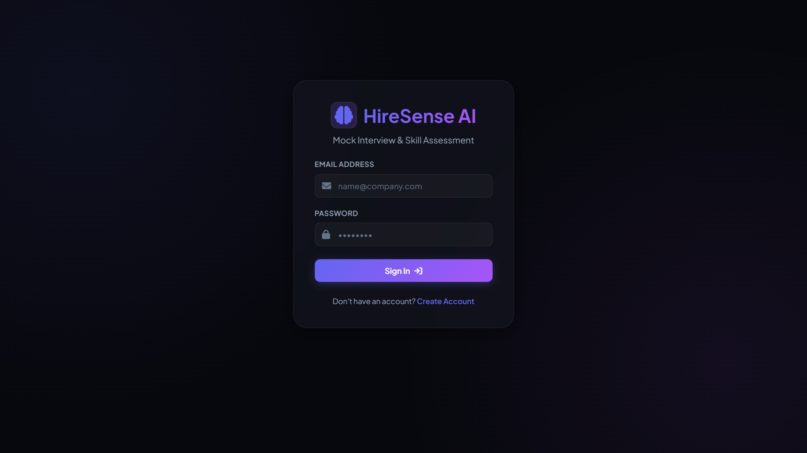
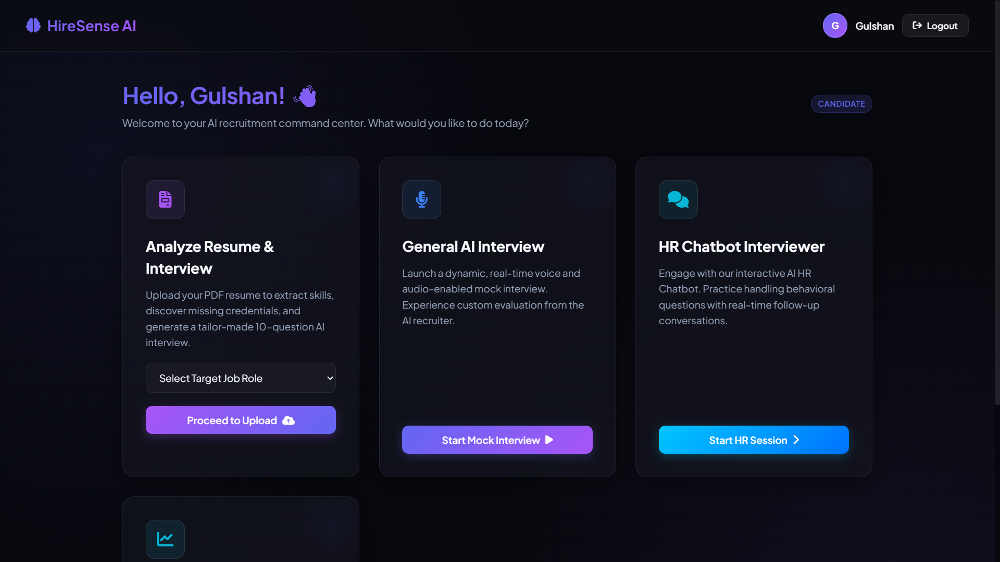
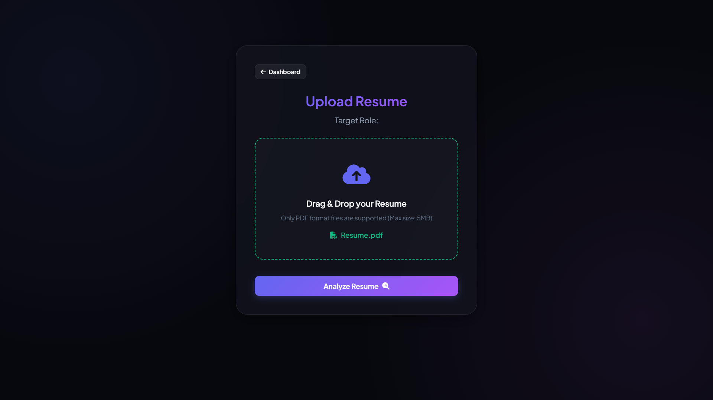
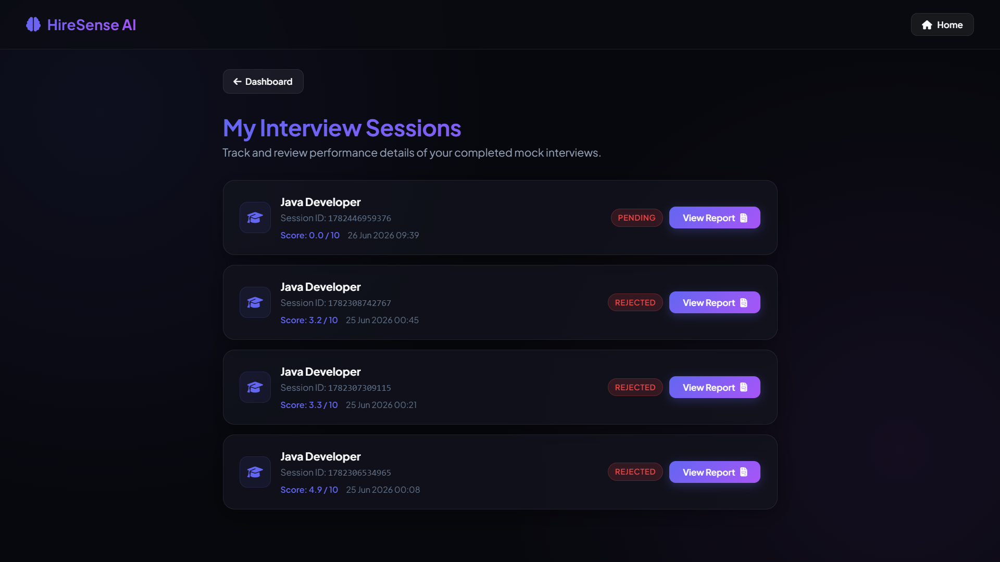
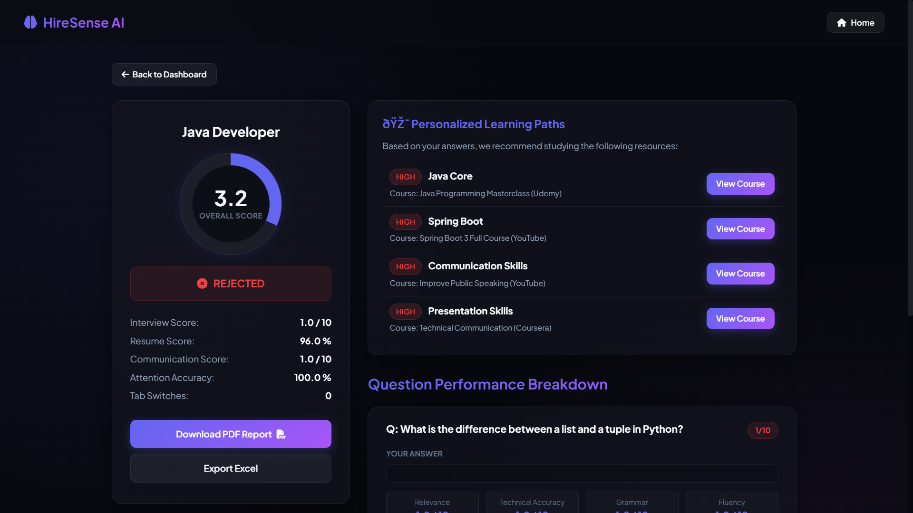
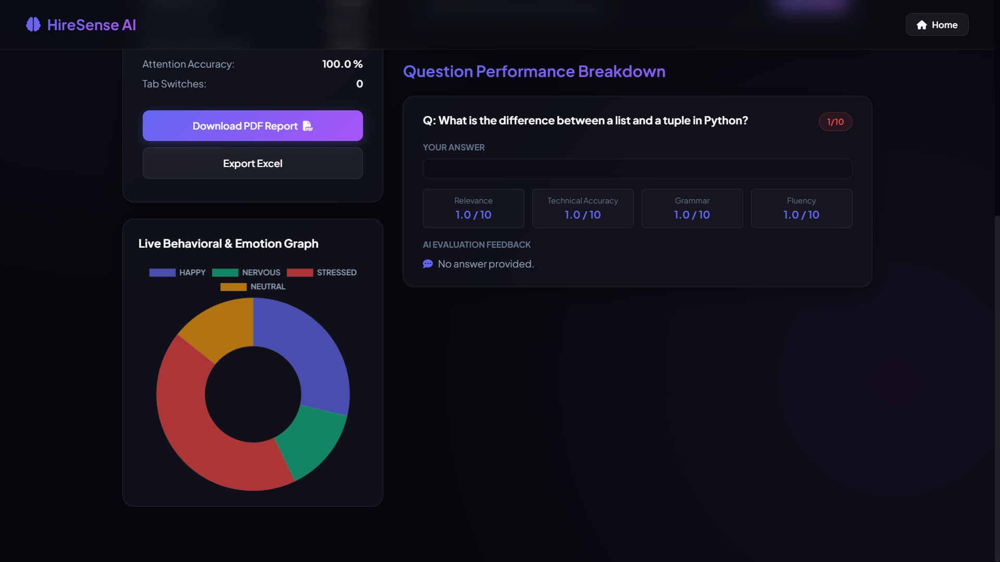

# HireSenseAI# HireSense AI

> An AI-powered interview assessment platform built with Spring Boot, MySQL, Groq AI, and Python Emotion Detection.

## Overview

HireSense AI helps recruiters automate the hiring process by evaluating candidates using Artificial Intelligence. It provides resume analysis, interview evaluation, emotion detection, report generation, and recruiter dashboards in one platform.

## Features

* Secure Login & Authentication
* Resume Upload & Management
* AI-Based Candidate Evaluation
* Emotion Detection using Python
* PDF Report Generation
* Excel Report Generation
* Recruiter Dashboard
* Candidate Management
* MySQL Database Integration
* RESTful Spring Boot Backend

## Tech Stack

**Backend**

* Java 21
* Spring Boot
* Spring Data JPA
* Spring Security
* Maven

**Database**

* MySQL

**AI**

* Groq API
* Python
* OpenCV
* FER (Emotion Recognition)

**Tools**

* Git
* GitHub
* IntelliJ IDEA

## Project Structure

```text
src/
 ├── main/
 │    ├── java/
 │    ├── resources/
 │    └── templates/
 └── test/
```

## Installation

Clone the repository:

```bash
git clone https://github.com/Gulshanbaghel46/HireSenseAI.git
```

Go to the project directory:

```bash
cd HireSenseAI
```

Run the application:

```bash
./mvnw spring-boot:run
```

Windows:

```bash
mvnw.cmd spring-boot:run
```

The application will start on:

```text
http://localhost:8081
```

## Environment Variables

Configure the following variables before running the project:

* SPRING_DATASOURCE_URL
* SPRING_DATASOURCE_USERNAME
* SPRING_DATASOURCE_PASSWORD
* GROQ_API_KEY
* MAIL_USERNAME
* MAIL_PASSWORD

## Screenshots

Add screenshots here after deployment.

* Login Page
* Dashboard
* Resume Upload
* Candidate Evaluation
* Reports

## Future Improvements

* Video Interview Analysis
* AI Interview Assistant
* Live Coding Round
* Speech Analysis
* Cloud Deployment
* Docker Support

## 📸 Project Screenshots

### Login Page


### Dashboard


### Resume Upload


### Interview Sessions


### AI Evaluation


### Report Generation


## Author

**Gulshan Baghel**

GitHub:
https://github.com/Gulshanbaghel46

## License

This project is licensed under the MIT License.

